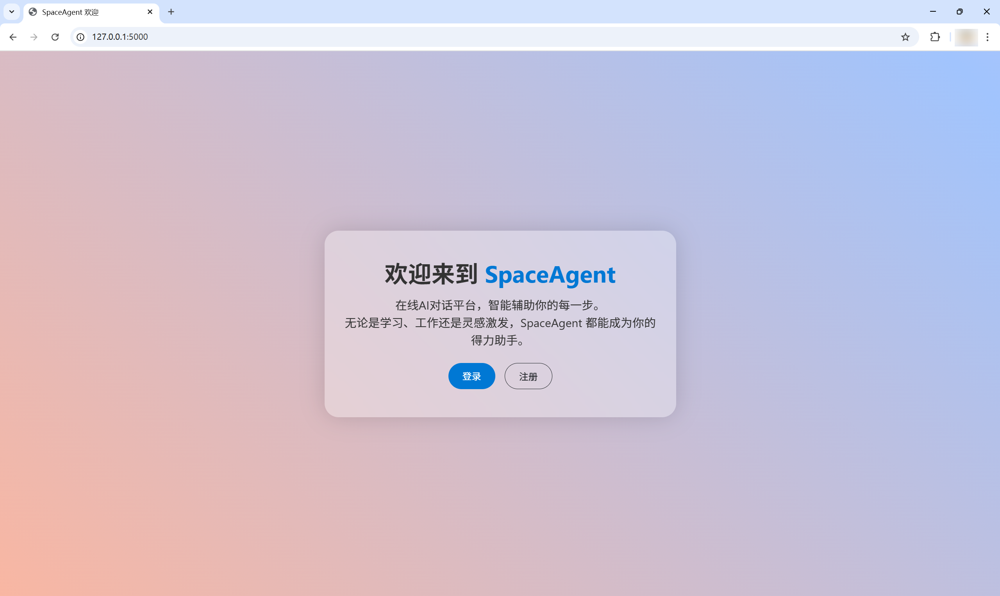
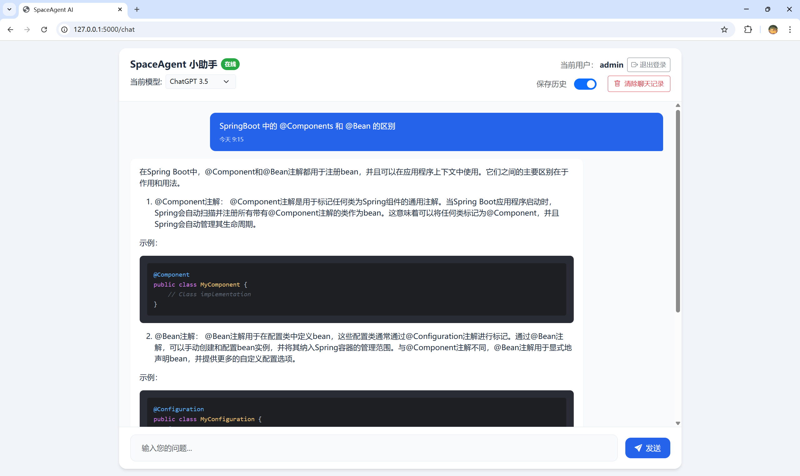

# SpaceAgent <span style="color: blue; font-size: 0.4em">四</span><span style="color: green; font-size: 0.4em">川</span>
一款AI问答界面程序，使用Flask + 传统前端做的AI基础应用，具有简单的登录、注册功能，你的历史聊天数据保存在本地LocalStroage，保证了你的的数据安全！支持模型切换、连续对话。


### 🐼 用的啷个开发技术栈唵？

- 前端: HTML + CSS + JavaScript + Jquery + BootStrap
- 后端: Python Flask
- 数据库: SQLite


### 🙈 实现的功能是啥子？

-  基础的 AI 问答
- 登录/注册
- 保存历史记录
- 删除历史记录
- MarkDown 解析
- 代码块复制
- 模型切换
- 未完待续 ...


### ✨ 那又啷个部署捏？

这个项目部署简单得很！有手就行:

1. 首先下载python 3.8 +，然后点击安装。注意哈，windows 上安装一定要选择添加到 PATH，不然输入 `python` 命令莫得反应。

2. 通过命令行，`cd` 到我们的目录，然后输入命令创建虚拟环境 (我人还挺好的哈，不破坏你的环境):

   ```shell
   python -m venv .venv
   ```

   然后启用你的 虚拟环境：

   ```shell
   .\.venv\Script\activate
   ```

   启用之后，你的终端前面会加上一个 `(venv)` 。

3. 安装依赖，使用下面的命令:

   ```shell
   pip installl -r requirements.txt
   ```

4. 原神启动~

   ```shell
   python app.py
   ```


### 🚀 界面展示

1. 登录、注册界面

   

2. 主页

   


### 💖 拿到手的这些模型都莫法用，应该咋个整？

拿到手不能用，其实是因为没有填写api-key。

首先，模型api的key我这边确实不能提供，防止信息泄露还有滥用，但是捏，我可以为你指一条明路：

1. 花点小钱，去deepseek买10块钱的资源包，然后到开放平台获取到key，填入到 app.py

   ```
   'deepseek': {
           'url': 'https://api.deepseek.com/chat/completions',
           'api_key': '<your_key>',
           'model': 'deepseek-chat',
           'name': 'Deepseek-v3'
   }
   ```

   

2. 去 **魔塔社区** 每天有2000次的免费测试额度。

3. 去那些卖 api key 的平台，注册一个账号，有测试额度。
